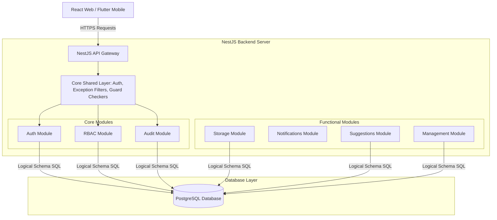

# Hospital Information System (HIS) Architecture Blueprint

This document details the software architecture, modular monolith patterns, boundaries, and API conventions governing the HIS application.

---

## 1. Modular Monolith Architecture Pattern

### Rationale
A **Modular Monolith** architecture combines the development and deployment simplicity of a single application unit with the strict structural boundaries of Microservices. 

- **Maintainability**: Low deployment friction; no complex container networking.
- **Code Separation**: Strict boundaries prevent coupling. Modules act as "virtual microservices" within the same codebase.
- **Scalability**: Can be easily split into microservices if scaling requirements demand independent hosting.

---

## 2. Module Boundary Rules

To prevent code entanglement (spaghetti dependency chains), the system enforces these strict access conventions:

1. **No Circular Imports**: Modules must not import internal files (e.g. controllers, entities, service helpers) belonging to other modules.
2. **Interface-Driven Integration**: When `ModuleA` needs to call code from `ModuleB`, it must only import `ModuleBService` through `ModuleBModule` export definitions.
3. **Database Segregation**: Modules must own their database tables. Direct SQL joins across module tables are prohibited. Inter-module data queries must be resolved at the application service tier.
4. **Decoupling via Events**: If a process in `ModuleA` triggers side-effects in `ModuleB` (e.g. creating an invoice triggers a notification email), use an asynchronous event dispatcher (e.g. NestJS `EventEmitter2`) rather than direct service calls.

---

## 3. Tech Stack Integration & Roles

- **NestJS (Backend)**: Enforces dependency injection, controller routes routing, global filters, and swagger metadata wrappers.
- **React (Web Frontend)**: Single-page application using TanStack React Query for local API cache synchronization. Styled using premium CSS variables and glassmorphic selectors.
- **Flutter (Mobile Frontend)**: High-performance client compiling native apps for iOS & Android. Uses Provider for reactive state management.
- **PostgreSQL**: Robust database engine support. Handles concurrency and transaction integrity.
